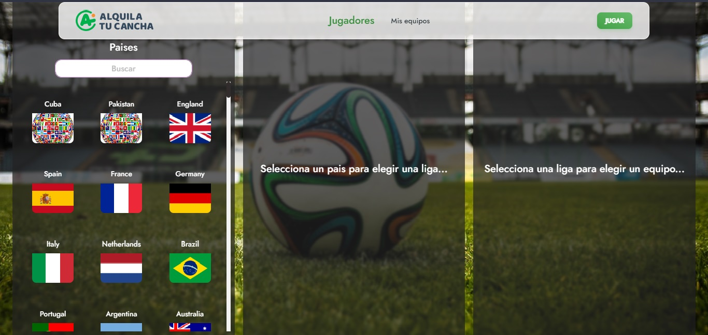
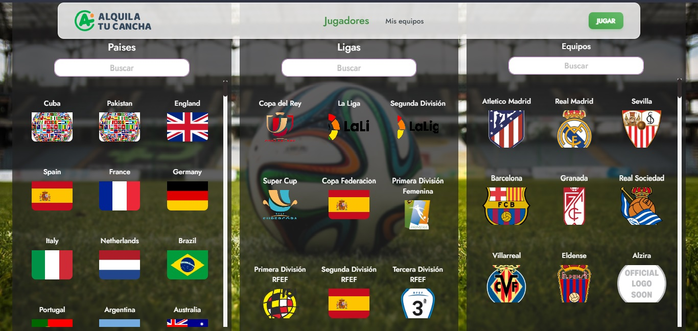
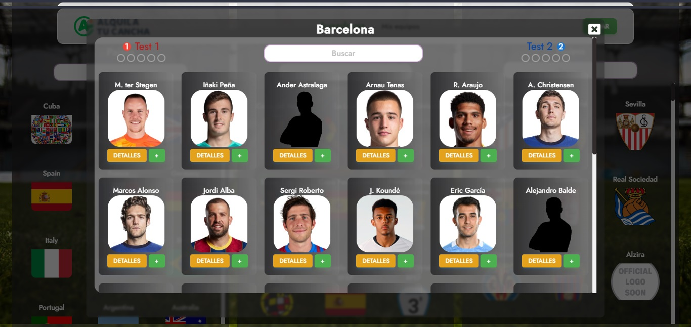
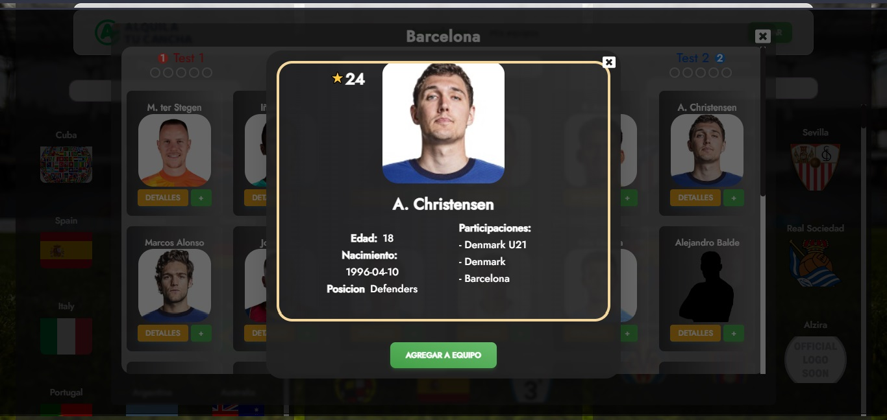
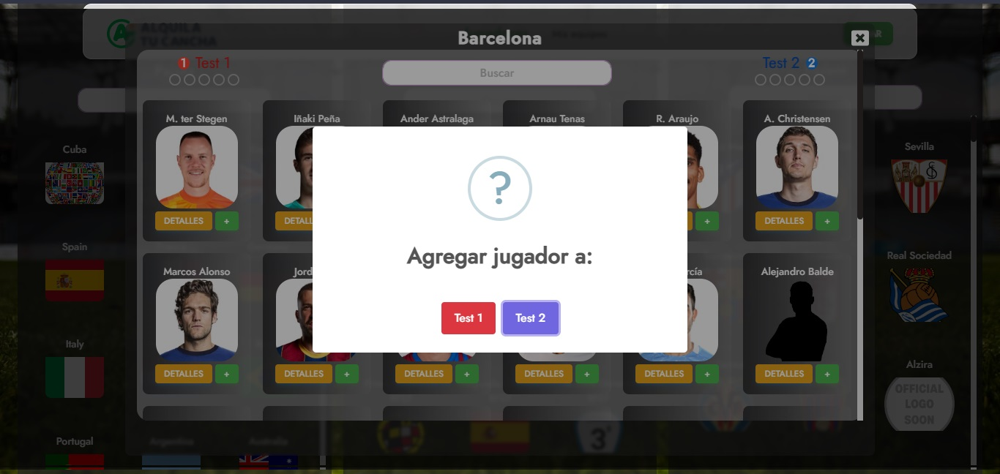
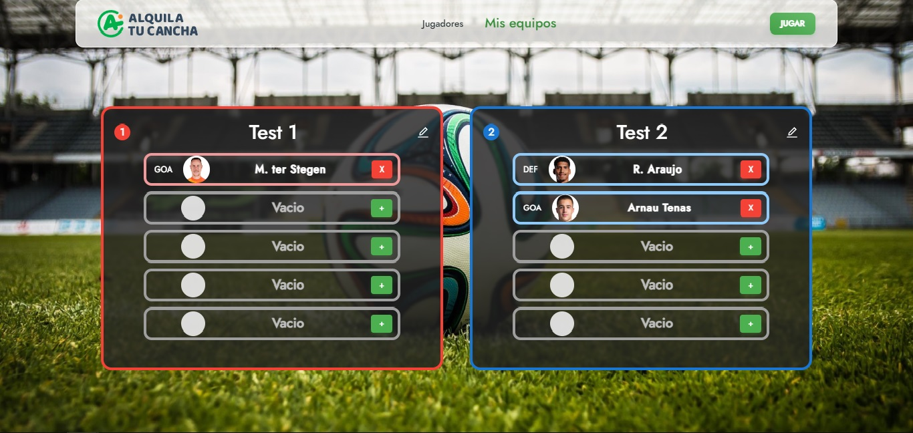
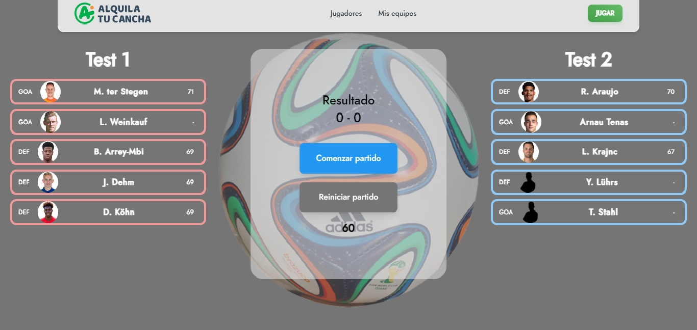

## React.js Challenge

---

### Indice:

<ul>
<li> <a href="#intro">Intro</a>
 <li><a href="#obj">- Objetivos del Proyecto</a></li>
 <li><a href="#stack">- Stack de tecnologias</a></li>
 <li><a href="#instrucciones">- Instrucciones para comenzar</a></li>
 </li>
 <br>
 <li><a href="#recorrido"> Recorrido</a></li>
<li> <a href="#landing">- Landing</a> 
 <li><a href="#createTeam">- Creacion de equipo</a></li>
<li><a href="#myTeams">- Mis Equipos</a></li>
 <li><a href="#match">- Jugar</a></li></li>

<ul>

<span id="intro"></span>

## Intro

¿Alguna vez soñaste con ver un partido de fútbol en donde se enfrenten tus jugadores favoritos? Imaginate poder armar dos equipos de 5 jugadores cada uno, en donde no tengas ninguna limitación... posición, presupuesto, contrato, club, edad... tu mente es tu límite.

<span id="obj"></span>

### Objetivos del Proyecto:

En **Alquila tu Cancha** deseamos crear una web app `[responsive desktop y mobile]` que se pueda crear **"El partido de tus sueños"**, un partido de fútbol 5 en donde se enfrenten tus 10 jugadores favoritos, consumiendo la API https://apifootball.com/documentation/

<span id="stack"></span>

### Stack

- React.js (Obligatorio)
- Docker (Preferentemente)
- Tailwind CSS (Obligatorio)
- Git (Obligatorio)
  <span id="intro"></span>

<span id="instrucciones"></span>

### Instrucciones para iniciar:

- Instalar dependecias ingresando en nuestro terminal el comando:

```bash
npm install
```

- Inicializar ingresando el comando:

```bash
npm run dev
```

<span id="recorrido"></span>

## Recorrido:

<span id="landing"></span>

### Landing:

- Al comenzar nos encontramos con una landing page con una breve descripcion de la aplicacion y un boton para ingresar.

<p align="center"><p>

<span id="createTeam"></span>

### Creacion de equipos:

- Al ingresar se nos presenta una pantalla simple para nombrar nuestros dos equipos.
- Navbar en la parte superior presente en toda la pagina para poder navegarla, en este momento sus funcionalidades estan desactivadas.
<p align="center"><p>

- A continuacion podemos ver una pantalla para seleccionar jugadores a partir de filtrados empezando por elegir el pais, seguido la liga y finalmente el equipo.
- En cada columna tenemos una barra de busqueda para buscar dentro de los/las paises/ligas/equipos
- Las funcionalidades del Navbar se activan a aprtir de esta pantalla.

<p align="center"><p>
<p align="center"><p>

- Al elegir un equipo se nos despliega una vista de los jugadores del equipo seleccionado. Ademas en la parte superior tenemos una barra de busqueda para filtrar dentro de los jugadores del equipo y a los costados podemos ver informacion del estado de nuestros dos equipos (cantidad de jugadores y cuantos faltan para que se llenen). En laparte inferior de cada jugador tenemosdosbotones, uno para ver detalles y otro para agregar al equipo.

<p align="center"><p>

- Al presionar ver detalles se nos despliega una vista con los detalles/estadisiticas del jugador y un boton para agregar a un equipo

<p align="center"><p>

- Vista cuando presionamos el boton de agregar jugador, tanto en la vista de jugadores como en el detalle. Al llenarse un equipo no se mostrara dicho boton y nos informara del equipo que esta lleno.
<p align="center"><p>

- En el transcursode la seleccion de jugadores iremos viendo como se completan los indicadores y si un jugador ya fue agregado no se podra volver a agregar a ninguno de los equipos.
<p align="center"><p>

<span id="myTeams"></span>

### Mis Equipos:

- Si navegamos a "Mis Equipos" nos encontramos con el estado de nuestros equipos pudiendo ver la cantidad de jugadores seleccionados, los espacios restantes, eliminar/agregar jugadores y un boton para editar el nombre de nuestros equipos.

<p align="center"><p>

<span id="match"></span>

### Jugar:

- Finalmente si le damos al boton jugar podremos acceder a una simulacion de un partido(solamente si tenemos ambos equipos completos) entre los 5 jugadores de cada equipo con un mecanismo de probabilidades segun el rating de cada jugador con una duracion unica de 60 segundos.

<p align="center"><p>
